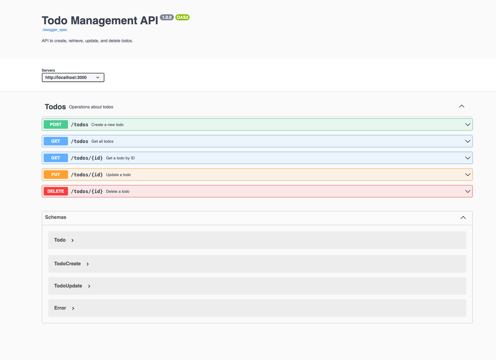

# Go REST API Template

## Running the App with Air

Air will watch for changes in your Go files and automatically restart the application.
To run the application with Air, follow these steps:

``` sh
$  go get -u github.com/cosmtrek/air

$  air
```

Alternatively, you can execute 
``` sh
$  go run ./cmd/server/main.go
```

## Using `go generate`

This template utilizes `go generate` to automate the generation of REST api models which are declared on the OpenAPIv3.0 spec found inside `./api/api.yaml`.

This template also uses [Ent](https://entgo.io/) as a database model access layer framework. 
ORM's are an opinionated topic, but the template should allow for an easy switch to [GORM](https://gorm.io/) or [SQLC](https://docs.sqlc.dev) depending on the need.

``` sh
# This will run all the `//go:generate` directives found in the project.

$  go generate ./api
$  go generate ./database/ent

```

## Template Structure

``` md
project/
├── api/                      # Swagger models and OpenAPI-related files
│   ├── models/
│   │   ├── user_input.go     # auto generated swagger request/response models
│   │   └── user_response.go
│   └── api.yaml                 # OpenAPI spec (YAML/JSON)
├── cmd/                      # Main entry points
│   └── service/         
│       └── main.go           # Echo server start
├── config/
│   └── config.go             # Configuration setup
├── database/                 # Database-related code
│   ├── ent/                  # Ent schema and generated files
│   ├── migrations/           # Database migrations
├── internal/                 # Core application logic
│   ├── handler/              # HTTP handlers for Echo
│   │   └── user_handler.go
│   ├── service/              # Business logic services
│   │   └── user_service.go
│   ├── repository/           # Database interaction repositories
│   │   └── user_repository.go
├── pkg/                      # Shared libraries or utilities
│   ├── logger/               # Logrus setup
│   ├── utils.go/             # Standardized API response helpers
├── .air.toml                 # Air configuration for live reload
├── .env                      # Environment variables
├── go.mod                    # Go module file
├── go.sum                    # Go module dependencies
└── main.go                   # Main application entry point
```

## Heading to http://localhost:3000/swagger



## Testing
``` sh
# coming soon
```
